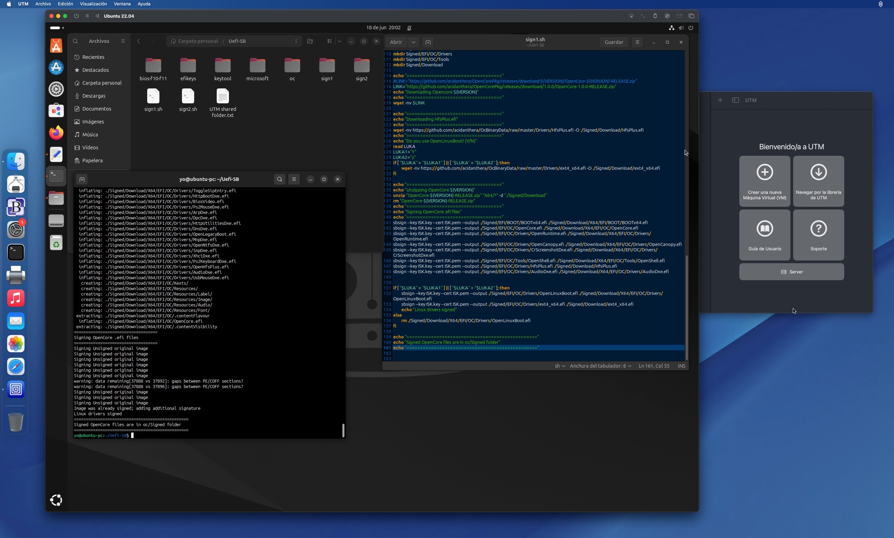

## OpenCore and UEFI Secure Boot with UTM on macOS

This is another way to enable UEFI Secure Boot with OpenCore without having to install Windows or create a live Linux USB. The entire task is done from within macOS. Clipboard and shared folder features that allow live sharing of text and files between macOS and Linux make the task easier.

### UTM

UTM is an app that allows you to use virtual machines on macOS and iOS. It is free and open software. Information and downloads are available on [GitHub](https://github.com/utmapp/UTM) and on the [website](https://mac.getutm.app).

UTM offers preconfigured virtual machines that you just have to attach to the app and start, it is not necessary to previously install the operating system. You can visit the [Gallery of Virtual Machines](https://mac.getutm.app/gallery/).

Among the preinstalled virtual machines there is no Ubuntu 22.04 but UTM has a [guide](https://docs.getutm.app/guides/ubuntu/) to download and install this version of Ubuntu. I have followed this guide to have an Ubuntu 22.04 virtual system on macOS.

It is important to configure the clipboard and shared folder between macOS and Linux. The guide explains how to do it. Shared clipboard works after installing SPICE Agent which also improves screen resolutions and dynamic switching between them. Its installation is highly recommended, as is QEMU Agent (Additional features such as time syncing, etc.).

Directory sharing can work in 2 different ways: SPICE WebDav or VirtFS. I have used VirtFS which allows you to show the macOS shared folder in the Ubuntu file system. To do this you have to do in Terminal:

- Create the shared directory `sudo mkdir Shared`
- Mount the shared directory `sudo mount -t 9p -o trans=virtio share Shared -oversion=9p2000.L`
- Add an entry in fstab to mount the shared folder at boot
	- Open fstab `sudo pico /etc/fstab`
	- Add this entry `share /home/yo/Shared 9p trans=virtio,version=9p2000.L,rw,_netdev,nofail 0 0`
	- Save with Ctrl + O and exit with Ctrl + X.

---

### Creating the keys and signing OpenCore

In my Home folder I have created a folder to work on. I have called it Uefi-SB. Inside this folder I only need to have a script that automates the process and performs all the tasks without user intervention:

- Create a folder named efikeys and switch to this folder
- Create PK, KEK and db keys
- Download the 2011 Microsoft certificates
- Sign Microsoft certificates
- Convert PEM files to ESL
- Create the database of allowed signatures and hashes
- Sign ESL files to AUTH suitable for integration into firmware
- Exit efikeys, create the oc folder and switch to it
- Copy the ISK.key, ISK.pem, PK.auth, KEK.auth and db.auth files to oc (ISK to sign OpenCore and auth to shove into the firmware)
- Download and unzip OpenCore 1.0.0 (you can set the version in the script and in the Terminal command that runs it)
- Download HFSPlus (thanks to Daniel Hurtado)
- Sign OpenCore .efi files (Drivers, Tools and OpenCore.efi).

Original script is from user Profzei based on Roderick W. Smith. I use 2 slightly modified versions:

- `sign1.sh`: Lukakeiton modified the code to ask if OpenLinuxBoot.efi is used and, if so, also download and sign the required drivers; in the end not all the drivers are signed but only those chosen by the user and the are saved  in the Uefi-SB/oc/Signed folder. [See code](../src/sign1.sh).
- `sign2.sh`: Andres Hurtado added HFSPlus.efi. Andrew Blitss added recursively signing of all OpenCore files with an .efi extension. [See code](../src/sign2.sh).

The .auth files in the Uefi-SB/oc folder are the ones you have to integrate into the firmware.

---

### Include signatures into the firmware

Final step is to insert the signature files into the UEFI firmware, replacing the existing variables:

- db.auth >> **db (Signatures Database)**: UEFI signature database which may contain (any mixture of) public keys, signatures and plain hashes. It functions essentially as a whitelist of authorized keys and signatures to boot executables. By default, the db variable will be loaded with a set of public keys issued by various vendors authorized by Microsoft
- kek.auth >> **KEK (Key Exchange Keys)**: signature database containing one (or more) public keys. db updates must be signed by the private key of one of these keys (the PK cannot be used for this). By default, the KEK variable will be loaded with a public key issued by Microsoft
- pk.auth >> **PK (Platform key)**: may be used to sign user-mode updates to PK or KEK, but not db (nor can it be used to sign executables). By default, the PK variable will be loaded with a public key issued by the hardware vendor (for example, Gigabyte).

This can be done in 2 ways: BIOS menu or KeyTool. I use the BIOS menu because it is always available and I don't have to create a USB stick with an EFI partition in which to copy KeyTool.efi to the BOOT folder with the name BOOTx64.efi.

---

### UTM Ubuntu VM on macOS

