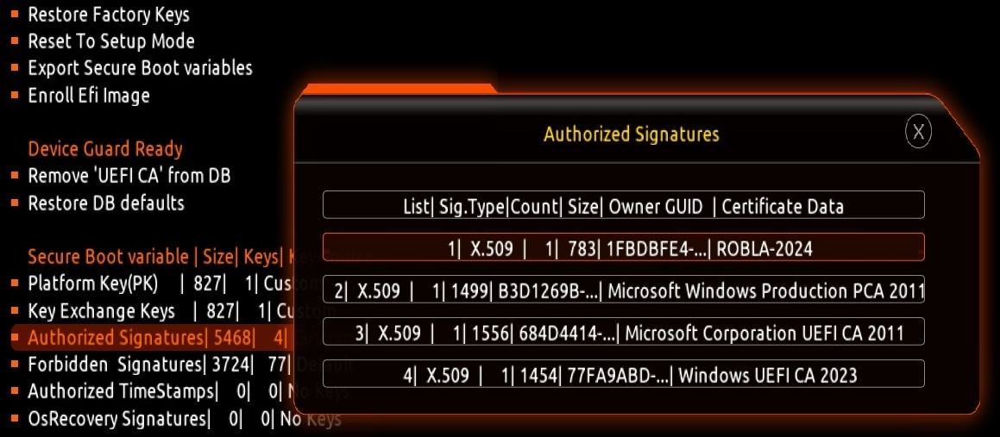

## Microsoft Corporation UEFI CA 2011 certificate revoked?

All current UEFI Microsoft certificates are expiring in 2026. These include the **Microsoft Corporation KEK CA 2011**, stored in the KEK database, and two certificates stored in the DB called **Microsoft Windows Production PCA 2011**, which signs the Windows bootloader, and **Microsoft UEFI CA 2011** (or third-party UEFI CA), which signs third-party OS and hardware driver components.

Microsoft is migrating to new ones. The first update will add the **Microsoft Windows UEFI CA 2023** to the firmware db. The new certificate will be used to sign Windows boot components prior to the expiration of the **Microsoft Windows Production CA 2011**. 

---

### Does my motherboard have the new certificate?

Some OEM manufacturers include the 2023 certificate in recent BIOS updates. It is a process that has started recently so (quite a few) UEFI firmware do not include it yet. For example, the latest BIOS version for my motherboard is F11 and it does not have this certificate, it only has the ones from 2011.

To check if you have the new certificate in the firmware go to the BIOS menu where you can see the secure boot keys >> Authorized Signatures (db) >> search for `Windows UEFI CA 2023`. If you only have `Microsoft Windows Production PCA 2011` and `Microsoft Corporation UEFI CA 2011` >> the firmware does not have the 2023 certificate.

---

### OpenCore and the new certificate

But OpenCore users operate differently. We have to create our own secure keys, sign the OpenCore files with them and insert them in the firmware instead of (or added to) the existing ones. 

I have generated new keys with the 2011 Microsoft certificates, which we were already using before the launch of the new 2023 certificate, and I have not found any issue to insert them into the firmware and boot OpenCore 1.0.0 digitally signed with these keys. It appears that OpenCore does not need the new 2023 certificate, as expected.

What is expected is that the most recent versions of Windows 11 and probably Linux do need this new certificate. However, I have booted Windows 11 (with the latest updates as of June 15, 2024) and Ubuntu 24.04, as well as OpenCore 1.0.0, with the keys created for OpenCore without still having the 2023 certificate in the firmware.

However, there are users who have had issues booting OpenCore with UEFI Secure Boot enabled after updating their motherboard BIOS, with the same secure variables that booted OpenCore before updating the BIOS. It may be something related to the manufacturer and model of the motherboard. In my case, Gigabyte Z390 Aorus Elite, I have not had this problem so far.

---

### Installing the new certificate

Windows UEFI CA 2023 certificate can be installed in 2 ways: BIOS menu or within Windows 11.

Installing the updated Microsoft certificate into the UEFI firmware is pretty easy:

1. Open PowerShell as administrator
2. Run `Set-ItemProperty -Path "HKLM:\SYSTEM\CurrentControlSet\Control\SecureBoot" -Name "AvailableUpdates" -Value 0x40`
3. Run `Start-ScheduledTask -TaskName “\Microsoft\Windows\PI\Secure-Boot-Update”`
4. Reboot (twice)
5. Check if the certificate has been installed. Run in PowerShell `[System.Text.Encoding]::ASCII.GetString((Get-SecureBootUEFI db).bytes) -match ‘Windows UEFI CA 2023’`. It must return True.

To install it from the BIOS menu you must download it in a compatible format. There is a Microsoft GitHub site [Secure Boot Objects](https://github.com/microsoft/secureboot_objects) where you can get all the Microsoft updated binaries in a format that you can insert into the firmware using the BIOS menu. This repository is used to hold the secure boot objects recommended by Microsoft to use as the default KEK, DB, and DBX variables:

1. Go to Releases and get `edk2-x64-secureboot-binaries`
2. Inside the package there are 4 .bin files:
	3. `DefaultPk.bin`
	4. `DefaultKek.bin`
	5. `DefaultDb.bin`
	6. `DefaultDbx.bin`
7. Go to the BIOS menú >> Secure Boot >> Key management >> replace the secure variables.
 
By updating the UEFI secure keys with these files, you set the motherboard with the latest versions of Microsoft secure variables. This fixes the *Certificate revoked* or *Security violation* issue that users can have when booting Windows or Linux with UEFI Secure Boot enabled and updated BIOS that includes the 2023 certificate.

But now you can't boot OpenCore with Secure Boot enabled because it is no longer signed with the existing keys in the firmware.

---

**Note**: You can add only `DefaultDb.bin` (2023 updated certificate) by appending (not replacing) to the existing db variables. If these are the ones we have created for OpenCore, the 2023 certificate is added to the 3 variables that already exist: our own KEK and the 2 Microsoft certificates from 2011. With this configuration, OpenCore boots fine with UEFI Secure Boot enabled.



---

**Note**: I have also generated OpenCore digital signatures by adding the 2023 certificate to the previously existing 2011 ones. Apparently the process has finished without errors and I have got the .auth files for the firmware and the digitally signed Opencore .efi files. But every time I have loaded these keys into the firmware, the BIOS has become unusable with beep error (bricked) and I have had to erase CMOS and boot from backup BIOS to recover it.

I got the 2023 certificate directly from Microsoft, the [link](https://go.microsoft.com/fwlink/?linkid=2239776) is in the Secure Boot Objects site. Downloaded file is `windows uefi ca 2023.crt` and it is not difficult to add it to the script that signs OpenCore within Ubuntu. But something is wrong when doing it like this because every time I have tried it I have had the severe problem with the BIOS.<br>
**So be careful if you try this**.

How did I add the 2023 certificate?

1. Downloaded from Microsoft. Just downloaded its name is `windows uefi ca 2023.crt`. It must be copied next to sign1.sh or sign2.sh before running the script
2. Added to the 2011 certificates code blocks of the script I was going to run:

```bash
echo "==================================="
echo "Signing Microsoft certificates"
echo "==================================="
openssl x509 -in MicWinProPCA2011_2011-10-19.crt -inform DER -out MicWinProPCA2011_2011-10-19.pem -outform PEM
openssl x509 -in MicCorUEFCA2011_2011-06-27.crt -inform DER -out MicCorUEFCA2011_2011-06-27.pem -outform PEM
openssl x509 -in 'windows uefi ca 2023.crt' -inform DER -out 'windows uefi ca 2023.pem' -outform PEM

echo "==================================="
echo "Converting PEM files to ESL"
echo "==================================="
cert-to-efi-sig-list -g $(uuidgen) MicWinProPCA2011_2011-10-19.pem MicWinProPCA2011_2011-10-19.esl
cert-to-efi-sig-list -g $(uuidgen) MicCorUEFCA2011_2011-06-27.pem MicCorUEFCA2011_2011-06-27.esl
cert-to-efi-sig-list -g $(uuidgen) 'windows uefi ca 2023.pem' 'windows uefi ca 2023.esl'

echo "==================================="
echo "Creating allowed database"
echo "==================================="
cat ISK.esl MicWinProPCA2011_2011-10-19.esl MicCorUEFCA2011_2011-06-27.esl 'windows uefi ca 2023.esl' > db.esl
```
---

### Links of interest

[KB5036210: Updating Microsoft Secure Boot keys Windows UEFI CA 2023 certificate to Secure Boot Allowed Signature Database (DB)](https://techcommunity.microsoft.com/t5/windows-it-pro-blog/updating-microsoft-secure-boot-keys/ba-p/4055324)

[KB5025885: How to manage the Windows Boot Manager revocations for Secure Boot changes associated with CVE-2023-24932](https://support.microsoft.com/en-us/topic/kb5025885-how-to-manage-the-windows-boot-manager-revocations-for-secure-boot-changes-associated-with-cve-2023-24932-41a975df-beb2-40c1-99a3-b3ff139f832d)

